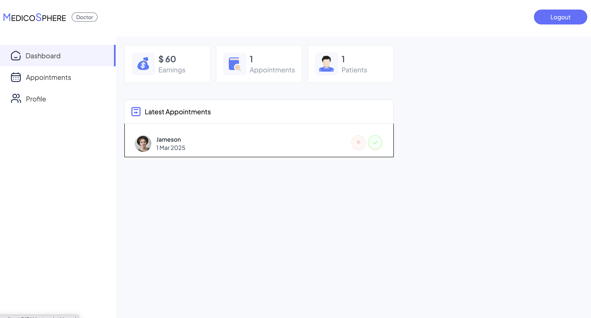
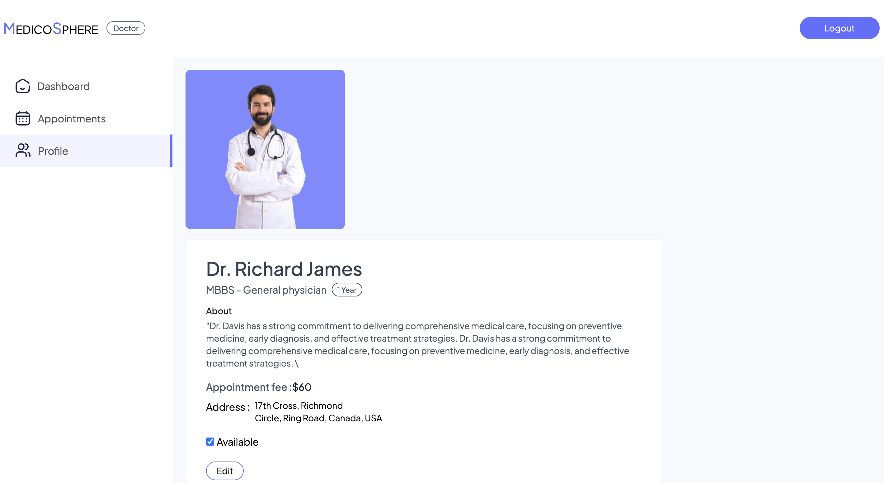

# MedicoSphere 🏥💊

## MedicoSphere is a **full-stack doctor appointment booking system** built using the **MERN stack**. This platform allows users to book doctor appointments, make online payments, and manage their medical schedules. It also provides an **admin panel** to manage doctors, appointments, and earnings.

## 🚀 Features

### 🔹 User Features:

- 📅 Book doctor appointments online
- 💳 Secure online payments (Razorpay integration)
- 🔍 Search for doctors based on specialization
- 📋 View and manage appointment history

### 🔹 Doctor Features:

- 📝 Edit profile and update availability
- 📅 View scheduled appointments
- 💰 Track earnings and payment history
- 📆 Schedule meetings with patients

### 🔹 Admin Features:

- 🏥 Manage doctor registrations
- 📋 View and control all appointments
- 📊 Monitor earnings and platform statistics
- 🚀 Approve or reject doctor applications

---

## 🛠️ Tech Stack

### **Frontend** (React + Tailwind CSS)

- **React.js** - For building UI components
- **Tailwind CSS** - For styling
- **React Router** - For navigation
- **Axios** - For API requests

### **Backend** (Express.js + Node.js + MongoDB)

- **Express.js** - Backend framework
- **MongoDB + Mongoose** - Database & ODM
- **JWT Authentication** - Secure login & user sessions
- **bcrypt.js** - Password hashing
- **Cloudinary** - Image storage
- **Razorpay** - Payment gateway
- **multer** - File uploads

### **Admin Panel** (React + Tailwind CSS)

- Built using **React.js** for managing doctors, appointments, and earnings.
- **React.js** - For building UI components
- **Tailwind CSS** - For styling
- **React Router** - For navigation
- **Axios** - For API requests

---

## 🚀 Installation & Setup

### 1️⃣ Clone the Repository

- git clone https://github.com/yashrao0001/MedicoSphere-Doctor-Appointment-Booking-Application.git
- cd MedicoSphere

### 2️⃣ Install Dependencies

- **Backend** : cd backend, npm install
- **Frontend** : cd ../frontend, npm install
- **Admin Panel** : cd ../admin, npm install

### 3️⃣ Setup Environment Variables

Create a .env file in the backend folder and add:

- MONGO_URI=your_mongodb_connection_string
- JWT_SECRET=your_secret_key
- CLOUDINARY_CLOUD_NAME=your_cloudinary_name
- CLOUDINARY_API_KEY=your_api_key
- CLOUDINARY_API_SECRET=your_api_secret
- RAZORPAY_KEY_ID=your_razorpay_key
- RAZORPAY_KEY_SECRET=your_razorpay_secret

### 4️⃣ Run the Project

- **Backend** : cd backend ,npm run server
- **Frontend** : cd frontend , npm start
- **Admin Panel** : cd admin, npm start
  The project will be live at:
- **Frontend**: http://localhost:5173
- **Backend API**: http://localhost:4000
- **Admin Panel**: http://localhost:5174

## 📸 Screenshots

## 📜 License

This project is licensed under the MIT License.

## 👨‍💻 Author

- **Yash Yadav**
- **GitHub**: https://github.com/yashrao0001
- **LinkedIn**: www.linkedin.com/in/yashyadav001

⭐ If you like this project, give it a star on GitHub! 🚀
